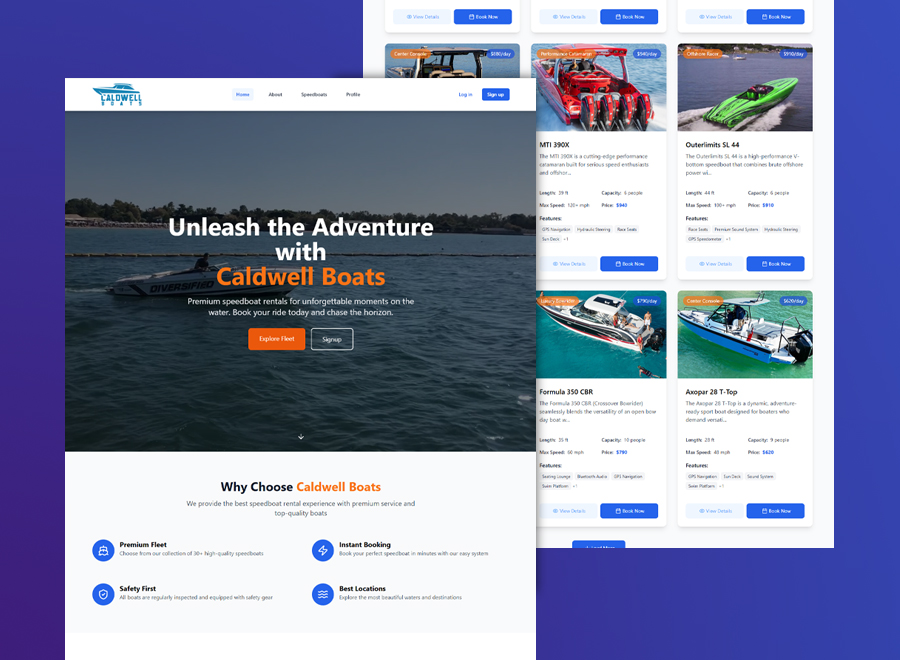
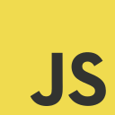

# 🚤 Caldwell Boats

A modern, responsive speedboat rental website built with **React**, **Vite**, and **Tailwind CSS**. This project is inspired by an actual client project I worked on last year, re-designed for learning and portfolio purposes. **Caldwell Boats** offers tourists and vacationers an easy way to browse and rent speedboats for their maritime adventures. Designs were made from Figma and Illustrator first.

## 📸 Preview & Demo



[Live Demo](https://caldwell-boats.vercel.app/)

## ✨ Features

- ⚛️ **React Router v6** for smooth page navigation and **nested routing**
- 🔍 **Dynamic multiple search** functionality based on URL search parameters
- 📖 **Progressive routing** (a simplified variant of pagination)
- 🎨 **Tailwind CSS** for modern, mobile-friendly, utility-first styling
- ⚡ Built with **Vite** for faster development and optimized builds

## 🛠️ Technogies

   

## 🛠️ Tools

  

## 📚 What I Learned

While building this project, I strengthened my skills in:

- Implementing **nested routing** with React Router v6
- Managing **dynamic search parameters via URL** for multiple search inputs
- Creating a **progressive routing system** as a variant to pagination
- Styling entire layouts responsively using **Tailwind CSS**
- Building a **real-world, client-inspired project workflow**

## 📂 Project Structure

```
├── public/
├── src/
│   ├── components/
│   ├── data
│   │    ├── booking.js
│   │    ├── speedBoats.js
│   │    ├── system.js
│   │    ├── users.js
│   ├── layout/
│   ├── pages
│   │    ├── about/
│   │    ├── booking/
│   │    ├── home/
│   │    ├── login/
│   │    ├── profile/
│   │    ├── signup/
│   │    ├── speedboat/
│   ├── App.jsx
│   └── main.jsx
├── tailwind.config.js
├── vite.config.js
└── index.html
```

## 📦 Installation

1. Clone the repository:

```bash
git clone https://github.com/kennyestrellaworks/caldwell-boats
cd caldwell-boats
```

2. Install dependencies:

```bash
npm install
# or
yarn install
```

3. Start the development server:

```bash
npm run dev
# or
yarn dev
```

4. Open your browser and visit:

```
http://localhost:5173
```

## 🔎 URL-Based Filtering

This app uses `useSearchParams` to handle advanced filtering directly through URL query parameters.

Example:

```
http://localhost:5173/speedboats?type=center+console&sort=name-ascending
```

Multiple filters can be applied simultaneously and the UI will react to changes in the URL.

## 📄 License

This project is open-source and licensed under the [MIT License](LICENSE).
